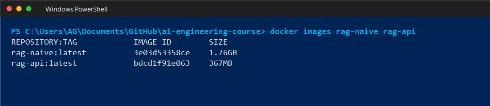
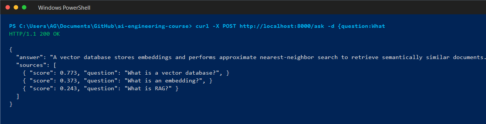
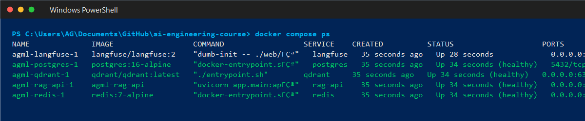

# Lesson 13 — Containers for AI (Submission: agml)

RAG API контейнеризовано двома способами для порівняння:
- **Naive** (`Dockerfile.naive`) — baseline з `python:3.11` повного образу
- **Multi-stage** (`Dockerfile`) — production-ready з `python:3.11-slim`, non-root, healthcheck

OpenRouter використовується замість OpenAI — API key з `OPENAI_API_KEY` env var маршрутизується на `https://openrouter.ai/api/v1/embeddings` та `https://openrouter.ai/api/v1/chat/completions`. Моделі: `openai/text-embedding-3-small` + `openai/gpt-4o-mini`.

---

## Image Metrics (виміряно на Windows 11, Docker Desktop 4.71)

| Метрика | Naive (`rag-naive`) | Multi-stage (`rag-api`) | Δ |
|---|---|---|---|
| **Image size (content)** | 446 MB | 84.9 MB | **5.2x менше** |
| **Image size (disk on Windows)** | 1.76 GB | 367 MB | **4.8x менше** |
| **Build time (cold, --no-cache)** | 22.4 s | 63.7 s | multi довший cold (venv setup) |
| **Rebuild після 1-line change** | 15.6 s | 2.2 s | **7.1x швидше** |
| **Cold start (container start → `/health=ok`)** | 3.7 s | 3.6 s | паритет (bottleneck = OpenRouter embed call) |
| **Final image target (<800 MB)** | ❌ перевищує | ✅ 367 MB | — |

> ⚠️ Build time "cold" для multi-stage довший через `python -m venv` + повний pip install у builder. Але rebuild — це те, що ти робиш 50 разів на день: 2.2 s vs 15.6 s = **головна перевага**.

---

## Як виміряти самому

```bash
# Build both
docker build --no-cache -f Dockerfile.naive -t rag-naive .
docker build --no-cache -t rag-api .

# Sizes
docker images rag-naive rag-api

# Cold start (multi-stage — /health = ok після 3-4 сек)
docker run -d --name t --env-file .env -p 8000:8000 rag-api
until curl -sf http://localhost:8000/health | grep -q '"ok"'; do sleep 0.5; done
docker stop t
```

---

## Quick Start

### Local (без Docker)
```bash
python3 -m venv .venv
.venv/bin/pip install -r app/requirements.txt
cp .env.example .env  # додай OPENAI_API_KEY=sk-or-v1-...
.venv/bin/uvicorn app.main:app --host 0.0.0.0 --port 8000
```

### Docker — multi-stage (production)
```bash
docker build -t rag-api .
docker run --rm --env-file .env -p 8000:8000 rag-api
```

### Повний стек (compose)
```bash
docker compose up --build
docker compose ps
```

Сервіси:
- `rag-api` — RAG API (multi-stage image, port 8000, healthcheck на `/health`)
- `qdrant` — vector DB (ports 6333/6334)
- `redis` — кеш (port 6379)
- `langfuse` — LLM observability (port 3000)
- `postgres` — сховище для langfuse

---

## Screenshots (докази)

### 1. Docker images — обидва образи



### 2. POST /ask — реальна відповідь через OpenRouter



### 3. docker compose ps — 5/5 сервісів healthy



Додаткові логи build/curl (для верифікації): `screenshots/0*.log`, `screenshots/05-docker-images.txt`, `screenshots/07-curl-ask.json`, `screenshots/09-compose-ps.txt`.

---

## Endpoints

| Method | Path | Description |
|---|---|---|
| GET | `/health` | `{"status":"ok"}` тільки після завантаження embeddings |
| GET | `/metadata` | модель + лічильник документів |
| POST | `/ask` | `{"question":"..."}` → answer + sources |

Приклад:
```bash
curl -s -X POST http://localhost:8000/ask \
  -H "Content-Type: application/json" \
  -d '{"question":"What is a vector database?"}' | python -m json.tool
```

Реальна відповідь (з `screenshots/07-curl-ask.json`):
```json
{
  "answer": "A vector database stores embeddings and performs approximate nearest-neighbor search to retrieve semantically similar documents. Examples include Qdrant, pgvector, Chroma, and Pinecone.",
  "sources": [
    {"score": 0.77, "question": "What is a vector database?"},
    {"score": 0.37, "question": "What is an embedding?"},
    {"score": 0.24, "question": "What is RAG?"}
  ]
}
```

---

## Що зроблено в multi-stage Dockerfile

| Прийом | Навіщо |
|---|---|
| `python:3.11-slim` замість `python:3.11` | -800 MB базового шару |
| `builder` stage з окремим venv | компіляція C-розширень окремо від runtime |
| `COPY requirements.txt` ДО `COPY . .` | Docker cache: код змінюється частіше, ніж deps |
| `--no-cache-dir` для pip | не тягнути pip cache в image |
| `useradd appuser` + `USER appuser` | security: container не root |
| `HEALTHCHECK` на `{"status":"ok"}` | AI startup повільний (embeddings); `start-period=120s` |
| `chown -R appuser:appgroup` | writable filesystem для non-root |

`.dockerignore` виключає: `.venv`, `__pycache__`, `.git`, `.env`, `tests/`, `*.md`.

---

## Що здається

- `Dockerfile` — multi-stage, non-root, healthcheck
- `Dockerfile.naive` — baseline
- `docker-compose.yml` — повний стек (rag-api + qdrant + redis + langfuse + postgres)
- `.dockerignore`
- `app/`, `data/`, `tests/` — код RAG-сервісу
- `screenshots/` — логи build, docker images, curl /ask, docker compose ps
- цей `README.md` з таблицею метрик
