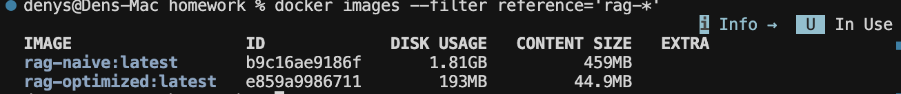
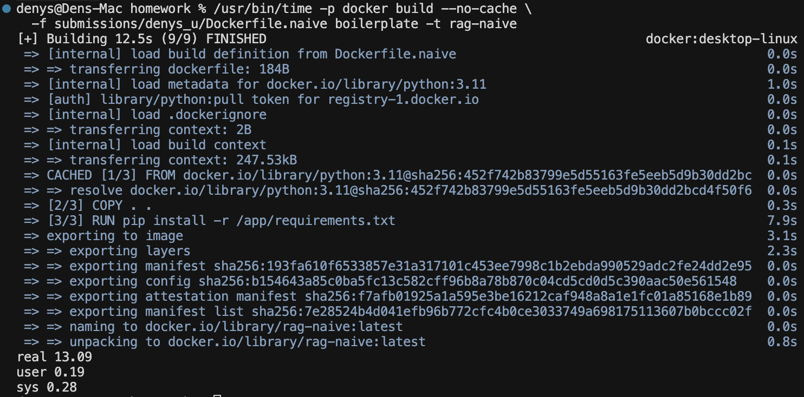
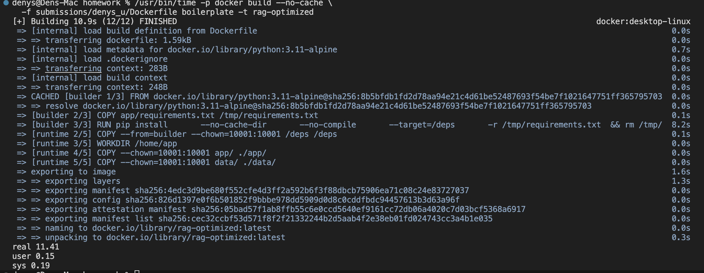
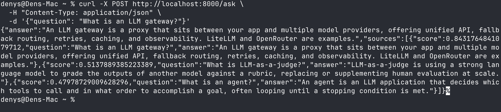
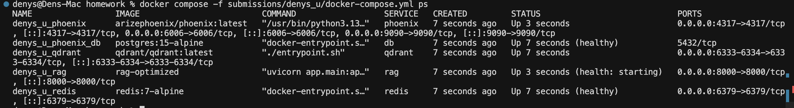

# Lesson 13 — Container homework (Denys Usenko)

## Metrics


| Метрика                      | Naive     | Multi-stage |
| ---------------------------- | --------- | ----------- |
| Image size                   | 451.71 MB | 42.85 MB    |
| Build time                   | 13.09     | 11.41       |
| Rebuild after code change    | 1.43      | 1.27        |
| Cold start (до `/health=ok`) | 0.93      | 1.54        |


## Screenshots

### Docker images

`docker images --filter reference='rag-*'` — naive vs optimized size:



Naive build (`Dockerfile.naive`):



Multi-stage build (`Dockerfile`):



### Ask endpoint working

`curl -X POST http://localhost:8000/ask` with question *What is an LLM gateway?*:



### Compose ps

`docker compose -f submissions/denys_u/docker-compose.yml ps`:



## Building Docker images

Run all commands from the **homework root** (`lesson-13-containers-for-ai/homework/`).

Dockerfiles are in `submissions/denys_u/`; **build context** is `boilerplate/` (`app/`, `data/`, `app/requirements.txt`).

### Naive image — build metrics

Record results in the [Metrics](#metrics) table (`real` from `time`, MB from step 2).

```bash
# 1) Clean build time (no layer cache)
/usr/bin/time -p docker build --no-cache \
  -f submissions/denys_u/Dockerfile.naive boilerplate -t rag-naive

# 2) Image size in megabytes (2 decimal places)
docker image inspect rag-naive --format '{{.Size}}' \
  | awk '{printf "%.2f MB\n", $1/1024/1024}'

# 3) Simulate an app code change
touch boilerplate/app/main.py

# 4) Rebuild after code change (cache allowed — no --no-cache)
/usr/bin/time -p docker build \
  -f submissions/denys_u/Dockerfile.naive boilerplate -t rag-naive

# 5) Cold start until /health is ok
python3 submissions/denys_u/measure_cold_start.py rag-naive
```

### Multi-stage image — build metrics

Copy `.dockerignore` into the build context, then record results in the [Metrics](#metrics) table (Multi-stage column).

```bash
# 0) Install .dockerignore at context root (once per session)
cp submissions/denys_u/.dockerignore boilerplate/.dockerignore

# 1) Clean build time (no layer cache)
/usr/bin/time -p docker build --no-cache \
  -f submissions/denys_u/Dockerfile boilerplate -t rag-optimized

# 2) Image size in megabytes (2 decimal places)
docker image inspect rag-optimized --format '{{.Size}}' \
  | awk '{printf "%.2f MB\n", $1/1024/1024}'

# 3) Simulate an app code change
touch boilerplate/app/main.py

# 4) Rebuild after code change (cache allowed — no --no-cache)
/usr/bin/time -p docker build \
  -f submissions/denys_u/Dockerfile boilerplate -t rag-optimized

# 5) Cold start until /health is ok
python3 submissions/denys_u/measure_cold_start.py rag-optimized
```

### Run and test (single container)

```bash
docker run --rm -p 8000:8000 --env-file boilerplate/.env rag-optimized

curl -X POST http://localhost:8000/ask \
  -H "Content-Type: application/json" \
  -d '{"question": "What is an LLM gateway?"}'
```

### Docker Compose (RAG + Qdrant + Redis + Phoenix)

```bash
cp submissions/denys_u/.dockerignore boilerplate/.dockerignore

docker compose -f submissions/denys_u/docker-compose.yml up -d --build
docker compose -f submissions/denys_u/docker-compose.yml ps

# RAG (wait until /health is ok)
curl http://localhost:8000/health
curl -X POST http://localhost:8000/ask \
  -H "Content-Type: application/json" \
  -d '{"question": "What is an LLM gateway?"}'

# Phoenix UI:  http://localhost:6006  (traces persisted in Postgres service `db`)
# Qdrant REST:  http://localhost:6333
# Redis:        localhost:6379

docker compose -f submissions/denys_u/docker-compose.yml down
```


