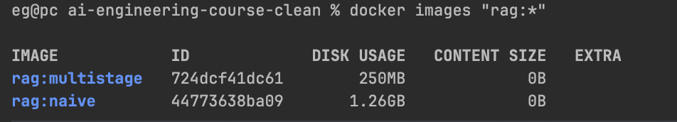
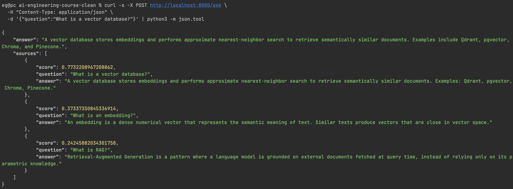
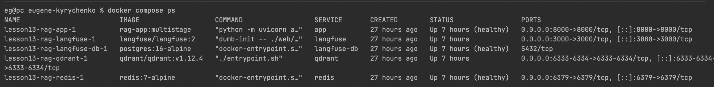

# Lesson 13 — Containers for AI (eugene-kyrychenko)

Контейнеризація RAG-сервісу з boilerplate: naive baseline → production multi-stage образ + `docker-compose` з AI-інфраструктурою.

## Структура

```
.
├── app/                 # RAG-сервіс (FastAPI + numpy + OpenAI), копія boilerplate
├── data/faq.jsonl       # 20 FAQ-документів
├── Dockerfile.naive     # baseline: FROM python:3.11 + COPY . . + pip install
├── Dockerfile           # multi-stage, non-root, HEALTHCHECK (<800 MB)
├── docker-compose.yml   # app + qdrant + redis + langfuse (+ langfuse-db)
├── .dockerignore
├── .env.example
└── screenshots/
```

## Запуск

```bash
cp .env.example .env          # впиши свій OPENAI_API_KEY
# одиночний production-образ:
docker build -t rag:multistage .
docker run -d --name rag --env-file .env -p 8000:8000 rag:multistage
curl -X POST localhost:8000/ask -H 'Content-Type: application/json' \
  -d '{"question":"What is RAG?"}'

# або весь стек:
docker compose up -d
docker compose ps
```

## Метрики

| Метрика | Naive | Multi-stage |
|---|---|---|
| Image size | **1.26 GB** | **250 MB** |
| Build time (cold) | 11 s | 11 s |
| Rebuild after code change | **11 s** | **~1 s** (0 s, 6 шарів CACHED) |
| Cold start (до `/health=ok`) | 2.6 s | 3.3 s |

**Результат:** образ зменшено в **~5×** (1.26 GB → 250 MB), rebuild після зміни коду — у **~11×** швидше.

> **Про cold start:** ~однаковий для обох (2–3 s) — його визначає не образ, а виклик OpenAI embeddings на старті (`rag.load()` ембедить 20 документів), різниця в межах варіації мережі. Виграш multi-stage — у розмірі та rebuild, не в cold start. HEALTHCHECK після старту → `healthy`.

### Методологія замірів

- Залізо: Apple Silicon, Docker 29.4.0, BuildKit.
- Базові образи (`python:3.11`, `python:3.11-slim`) **стягнуті наперед** — щоб «build time» відображав збірку, а не завантаження.
- «Build time (cold)» = `docker build --no-cache` з **теплим** wheel-кешем PyPI. Найперша холодна збірка naive зайняла **103 s** (одноразове стягування numpy та інших wheels із PyPI) — це не показник Dockerfile, тож у таблиці наведено стабільні 11 s.
- «Rebuild» = зміна 1 рядка в `app/main.py` + `docker build` **без** `--no-cache`.

## Чому naive такий великий і повільний на rebuild

1. **`FROM python:3.11`** — повний образ (~1.12 GB базою) проти `python:3.11-slim` (~150 MB). Це головна частина різниці в розмірі.
2. **`COPY . .` перед `pip install`** — будь-яка зміна коду інвалідовує цей шар, тож `pip install` **переганяється повністю** (0 кешованих шарів → 11 s щоразу).

`.dockerignore` Docker застосовує до **обох** збірок, тож context однаковий; різницю дають саме базовий образ і порядок шарів.

## Що зроблено в production `Dockerfile`

- **Multi-stage**: `builder` ставить залежності в `/deps` (`pip install --target`), `runtime` копіює лише `/deps` + код. Жодних build-артефактів у фінальному образі.
- **`python:3.11-slim`** базою.
- **Non-root**: `useradd --uid 1000 app`, `USER app`.
- **Cache-friendly порядок**: `COPY app/requirements.txt` + `pip install` → потім `COPY app/`. Зміна коду не ламає кеш залежностей.
- **HEALTHCHECK** перевіряє саме `status: ok` (а не просто HTTP 200) — тобто що модель завантажилась і ембединги готові:
  ```dockerfile
  HEALTHCHECK CMD python -c "import httpx,sys; r=httpx.get('http://localhost:8000/health',timeout=3); sys.exit(0 if r.json().get('status')=='ok' else 1)"
  ```

## docker-compose.yml

| Сервіс | Образ | Роль |
|---|---|---|
| `app` | build `./Dockerfile` | RAG-сервіс на :8000 |
| `qdrant` | `qdrant/qdrant` | vector database |
| `redis` | `redis:7-alpine` | cache / черги |
| `langfuse` | `langfuse/langfuse:2` | LLM observability на :3000 |
| `langfuse-db` | `postgres:16-alpine` | обовʼязкова БД для Langfuse |

> **Scope:** інфра-сервіси **оголошені** (як вимагає ДЗ). App наразі їх не використовує — він робить ембединги in-memory (numpy) і б'є напряму в OpenAI. Змінні `QDRANT_URL` / `REDIS_URL` / `LANGFUSE_HOST` передаються в `app` і готові до wiring (`config.py` має `extra="ignore"`, тож невідомі ключі не ламають старт). Langfuse v2 не стартує без Postgres — тому доданий `langfuse-db`.

## Скріншоти

**`docker images` — обидва образи (1.26 GB vs 250 MB):**



**`curl /ask` — реальна відповідь OpenAI + sources:**



**`docker compose ps` — усі 5 сервісів Up (app + langfuse-db `healthy`):**


