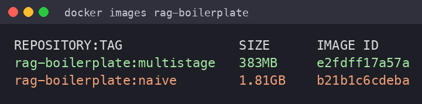
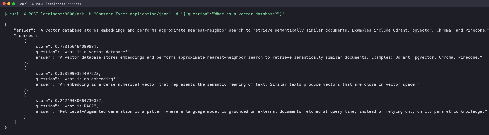
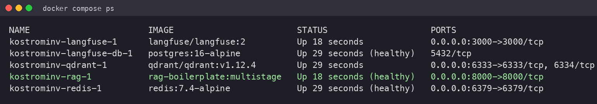

# Lesson 13 — Containers for AI

Контейнеризація RAG-боілерплейту (FastAPI + OpenAI embeddings/LLM). Порівняння
наївного образу проти оптимізованого multi-stage, повний локальний стек через
Docker Compose.

## Метрики

| Метрика | Naive | Multi-stage |
|---|---|---|
| Image size | **1.81 GB** | **383 MB** |
| Build time (з нуля, `--no-cache`) | 38.3 s | 24.5 s |
| Rebuild after code change (з кешем) | 13.0 s | **2.0 s** |
| Cold start (до `/health=ok`) | 1.9 s | 1.3 s |

**Підсумок:** multi-stage образ у **~4.7× менший** (–79 %) і перебудовується після
зміни коду у **~6.5× швидше**, бо залежності лежать у власному шарі, який кеш не
скидає при правці застосунку.

### Чому така різниця

| Аспект | Naive | Multi-stage |
|---|---|---|
| Базовий образ | `python:3.11` (~1 GB) | `python:3.11-slim` (~150 MB) |
| Залежності | `pip install` поверх `COPY . .` | окремий builder-стейдж → у фінал їде лише `/opt/venv` |
| Кешування | будь-яка зміна коду інвалідовує `pip install` | `requirements.txt` копіюється окремо → pip-шар кешується |
| Користувач | root | non-root `appuser` (uid 1000) |
| Healthcheck | немає | є, перевіряє `status: ok` |

## Що всередині `Dockerfile` (multi-stage)

1. **Stage `builder`** — встановлює залежності у venv `/opt/venv`. Build-інструменти
   й кеш pip лишаються тут і **не потрапляють** у фінальний образ.
2. **Stage `runtime`** — `slim`-база, створює `appuser`, копіює готовий venv та код,
   перемикається на non-root, додає `HEALTHCHECK`.

`HEALTHCHECK` робить HTTP-запит до `/health` і завершується успіхом лише коли
відповідь містить `{"status":"ok"}` (а це стається після того, як на старті
завантажились ембединги). `start-period=60s` покриває cold-start embedding-виклик
до OpenAI.

## Запуск

### Лише застосунок

```bash
cp .env.example .env          # вписати OPENAI_API_KEY
docker build -t rag-boilerplate:multistage .
docker run -d --env-file .env -p 8000:8000 rag-boilerplate:multistage
curl -X POST localhost:8000/ask -H 'Content-Type: application/json' \
  -d '{"question":"What is a vector database?"}'
```

### Повний стек (RAG + Qdrant + Redis + Langfuse + Postgres)

```bash
docker compose up -d --build
docker compose ps
```

| Сервіс | Порт | Призначення |
|---|---|---|
| `rag` | 8000 | FastAPI RAG API |
| `qdrant` | 6333 | векторна БД |
| `redis` | 6379 | кеш / черги |
| `langfuse` | 3000 | LLM-обсервабіліті |
| `langfuse-db` | — | Postgres для Langfuse |

## Скріншоти

### `docker images` (обидва образи)


### `curl -X POST localhost:8000/ask`


### `docker compose ps`


## Файли

| Файл | Опис |
|---|---|
| `Dockerfile` | multi-stage, non-root, healthcheck, < 800 MB |
| `Dockerfile.naive` | наївний baseline для заміру «до» |
| `docker-compose.yml` | застосунок + Qdrant + Redis + Langfuse + Postgres |
| `.dockerignore` | виключає venv, кеш, секрети, тести з build-контексту |
| `app/`, `data/` | копія боілерплейту, щоб образ збирався самодостатньо |

> Заміри виконані локально на Apple Silicon (Docker Desktop 27.3.1).
> Cold start залежить від мережевої затримки до OpenAI embeddings API.
